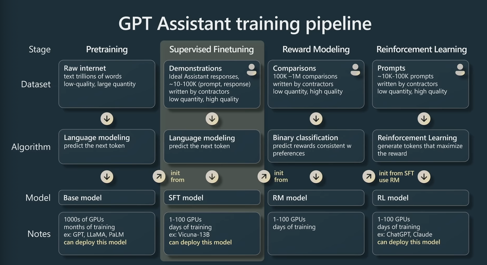
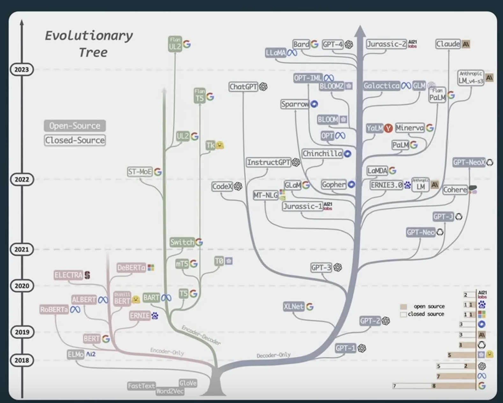
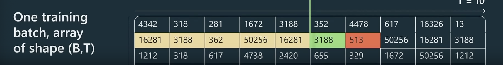
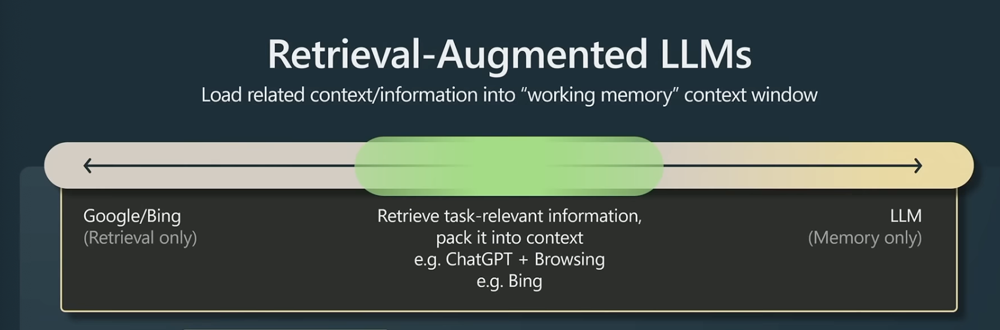

- {:height 431, :width 778}
- [[Tokenization]]
	- Turns raw text into discrete outputs
	- Typically 10-100k possible tokens
	- 1 token ~= 0.7 words
	- Typical Algorithm: [[Byte Pair Encoding]]
- [[Metrics]]
	- [[Context Length]] - The amount of tokens the model uses for reference
	- [[Vocab Size]] - The amount of possible tokens?
	- #todo #Optimizations --> train on more tokens (~5T Tokens)
	  id:: 6475ee80-13db-46b9-bbc7-9f5209c3bb29
	- Hyperparameters
		- Layers
		- Heads
		- LR
		- Batch Size
		- Tokens trained on
- [[Models]]
	- [[GPT-3]] 2020
		- 50,257 Vocab Size
		- 2048 Context Length
		- 175 B Parameters
		- Trained on 300B tokens
	- [[LLaMA]] 2023
	  More powerful than [[GPT-3]]
		- 32,000 Vocab Size
		- 2048 Context Length
		- 65 B Parameters
		- Trained on 1-1.14T Tokens
	- [[Model Tree]]
		- 
			-
- [[Pretraining]]
  collapsed:: true
  [[Base Model]]
	- Inputs are in the shape of (Batch, Context Length)
		- So one batch has (B, T) size
	- They are delineated with <|endoftext|> tokens
	- [[Question]] What happens when the input size is larger than context length?
	- [[Question]] When the model is trained on n tokens, are those unique? Multiple epochs? Like EX, [[LLaMA]] was trained on 1.4T Tokens, are those all unique?
		- Its the full dataset tokenized
	- Here the green is the current token, the yellow tokens are what is used to make the prediction after then green token. The red token is the desired token
	  
- Supervised [[Finetuning]]
  [[SFT Model]] <-- [[Vacuna]]
	- After the model is pretrainined, we can finetune on a specific downstream task with a small dataset
	- The overall training process dons't change, but rather just the dataset
	- #todo #Optimizations If doing Knowledge Distillation the strong generalization capability with the variety in the dataset is never reached. Maybe we have to dovetail prompts to address these topics? TSNE Viz of datasert training on cetner and working way out
	  id:: 6475f2fd-b12b-4ad7-9cca-8fb3296192cf
	- [[Prompting]]/[[Fewshot]]/[[zeroshot]] - uses the model's generalization capability to do finetuned tasks without ever finetuning the model
	- Techniques
		- Parameter Efficient FineTuning ([[PEFT]])
			- [[LoRA]]
		- [[low-precision inference]] [[bitsandbytes]]
		- High quality base models
	-
- [[RLHF]] - [[Reinforcement Learning]] from Human Feedback
  collapsed:: true
  [[RM Model]] & [[RL Model]] <-- ChatGPT
	- Involves [[reward modeling]] and reinforcement learning
	- Rank n possible [[SFT Model]] with human (I heard a paper do that with other llms)
	- #Optimizations Can we use RL for knowledge distillation?
- [[Model Collapse]]
  collapsed:: true
	- As models are [[Finetuning]] and [[RLHF]], the model entropy is lossed
		- Meaning the variety and creativity of the [[Base Model]] is lost
	- #todo #Optimizations How can we combine the entropy from base model and responses from finetuned models
	  id:: 64761851-4cfb-4afc-b912-5fb6ec57f74c
		- After pretraining, when doing supervised [[Finetuning]] somehow (maybe with embedding space) don't have a strict target, reward if semantically the same (if the distance between the pred and target are close in the embedding space)
	-
	-
	-
	-
- [[LLM Applications]] [[Downstream Tasks]]
  collapsed:: true
	- #Optimizations Could we use [[rewind.ai]]  to track our though process, and then finetune in the format of langchain?
	- [[System 2]] thinking
		- [[tokens]] are [[thoughts]] so the more computation it can do per token, the more thought it can put into each tooken.
			- Hence, if you ask it to show its work, it does better as the reasoning is building up over time.
		- [[Ensemble multiple attempts]] - allows to rewrite and overide an incorrect thought
	- 
		- Retrieval vs Memory models
	- [[Constrained Prompting]]
		- fill out templates (such as json)
	-